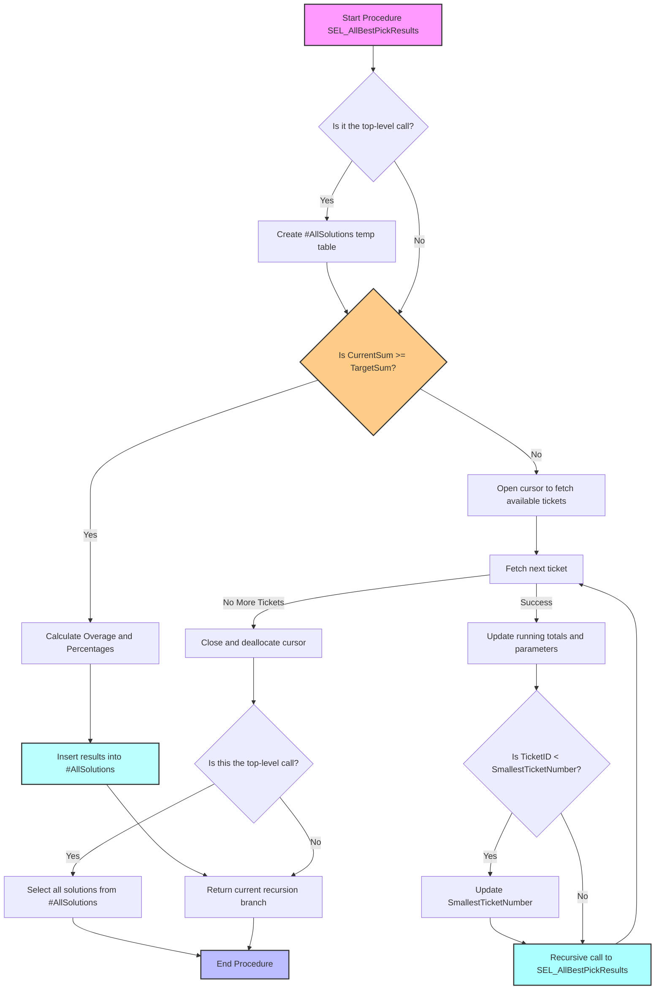

# SEL_AllBestPickResults Documentation

## Purpose
The `SEL_AllBestPickResults` stored procedure generates all possible combinations of tickets to meet or exceed a target sum for a specified pledgee. The procedure prioritizes results based on calculated percentages, contributions, overages, and ticket counts.

---

## Parameters
| **Parameter**            | **Type**        | **Description**                                             |
|---------------------------|-----------------|-------------------------------------------------------------|
| `@TargetSum`             | `INT`           | Target sum to achieve.                                      |
| `@Pledgee`               | `VARCHAR(50)`   | Specific pledgee to prioritize.                            |
| `@CurrentSum`            | `INT`           | Running sum during recursion (default: 0).                 |
| `@SelectedIDs`           | `VARCHAR(MAX)`  | Comma-separated list of selected ticket IDs.               |
| `@SelectedPledgees`      | `VARCHAR(MAX)`  | Comma-separated list of selected pledgees.                 |
| `@SelectedIntent`        | `VARCHAR(MAX)`  | Comma-separated list of ticket intentions.                 |
| `@LastID`                | `INT`           | Last processed ticket ID to avoid duplicates.              |
| `@PriorityTicketType`    | `VARCHAR(50)`   | Priority ticket intention type (default: 'AFS').           |
| `@IncludeAllIntentions`  | `BIT`           | Include all intentions or prioritize specific ones.        |
| `@IncludeAllPledgees`    | `BIT`           | Include tickets from all pledgees or specific pledgee.     |
| `@TicketCount`           | `INT`           | Number of tickets used in the current combination.         |
| `@PledgeeSum`            | `INT`           | Sum of amounts contributed by the specified pledgee.       |
| `@SmallestTicketNumber`  | `VARCHAR(50)`   | Smallest ticket number encountered in the current path.    |

---

## Logic Flow


---

## Temporary Table: `#AllSolutions`
| **Column**               | **Type**          | **Description**                                             |
|---------------------------|-------------------|-------------------------------------------------------------|
| `Combination`            | `VARCHAR(MAX)`    | Comma-separated list of ticket IDs.                        |
| `PledgeeCombination`     | `VARCHAR(MAX)`    | Comma-separated list of pledgees.                          |
| `IntentCombination`      | `VARCHAR(MAX)`    | Comma-separated list of intentions.                        |
| `TotalAmount`            | `INT`             | Total sum of amounts in the current combination.           |
| `CalculatedPercent`      | `DECIMAL(18,2)`   | Percentage of the target sum achieved.                     |
| `DifferencePercent`      | `DECIMAL(18,2)`   | Difference from 100%.                                      |
| `PledgeeSum`             | `INT`             | Sum of amounts contributed by the specified pledgee.       |
| `Overage`                | `INT`             | Amount exceeding the target sum.                           |
| `TicketCount`            | `INT`             | Number of tickets used in the combination.                 |
| `SmallestTicketNumber`   | `VARCHAR(50)`     | Smallest ticket number in the combination.                 |

---

## Usage Example
```sql
EXEC [dbo].[SEL_AllBestPickResults]
    @TargetSum = 5000,
    @Pledgee = 'JohnDoe',
    @PriorityTicketType = 'AFS',
    @IncludeAllIntentions = 1,
    @IncludeAllPledgees = 0;
```

---

## Notes
- **Performance Considerations:**
  - Ensure indexes exist on ticket-related columns.
  - Monitor recursion for large data sets.
- **Testing:** Validate outputs for edge cases like:
  - Small target sums.
  - Large numbers of tickets.
  - Duplicate ticket IDs.

---

## Generated with Mermaid
- Use [Mermaid Live Editor](https://mermaid.live/) to view and export the flowchart.
