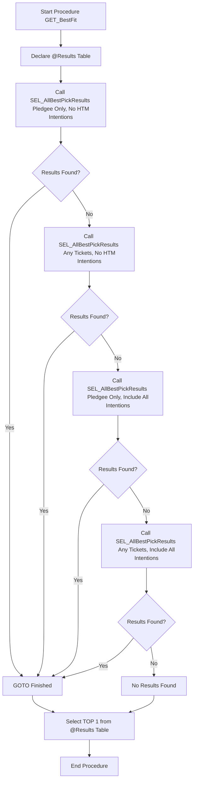

# GET_BestFit Documentation

## Purpose
The `GET_BestFit` procedure calls the `SEL_AllBestPickResults` stored procedure multiple times to determine the **best ticket combination** for a given pledgee and target amount. It follows a hierarchical search strategy to optimize the result selection.

---

## Parameters
| **Parameter** | **Type**       | **Description**                                 |
|---------------|----------------|-------------------------------------------------|
| `@Pledgee`   | `VARCHAR(50)`  | The pledgee for which the best fit is calculated. |
| `@Amount`    | `INT`          | The target amount to find the best ticket combination for. |

---

## Logic Flow


---

## Workflow Steps

### 1. Declare Results Table
- Create a table variable `@Results` to store intermediate results returned by `SEL_AllBestPickResults`.

### 2. Call `SEL_AllBestPickResults` in Four Variants
The procedure attempts to find the best ticket combination through the following calls:

- **First Call**: 
   - Includes only tickets belonging to the specified pledgee.
   - Excludes HTM intentions (`@IncludeAllIntentions = 0`).
   - If results are found, proceed to select the top result.

- **Second Call**:
   - Includes any tickets (assigned or unassigned).
   - Excludes HTM intentions (`@IncludeAllIntentions = 0`).
   - If results are found, proceed to select the top result.

- **Third Call**:
   - Includes only tickets belonging to the specified pledgee.
   - Includes all intentions (`@IncludeAllIntentions = 1`).
   - If results are found, proceed to select the top result.

- **Fourth Call**:
   - Includes any tickets (assigned or unassigned).
   - Includes all intentions (`@IncludeAllIntentions = 1`).
   - If results are found, proceed to select the top result.

### 3. Check for Results
- After each call, the procedure checks for the presence of results in the `@Results` table.
- If results exist, the flow jumps to the `Finished` label.

### 4. Select Top Result
- Select the **TOP 1** result from `@Results` table based on the following fields:
   - `TicketCombination`
   - `PledgeeCombination`
   - `IntentCombination`
   - `TotalAmount` as `TotalAmountInTicketCombination`
   - `CalculatedPercent` as `RankingPercentage`
   - `Overage` as `AmountOverTarget`
   - `TicketCount`

### 5. Return the Results
- Return the selected result and terminate the procedure.

---

## Output
| **Column**               | **Type**           | **Description**                                   |
|---------------------------|--------------------|--------------------------------------------------|
| `TicketCombination`      | `VARCHAR(MAX)`     | Comma-separated list of ticket IDs in the combination. |
| `PledgeeCombination`     | `VARCHAR(MAX)`     | Comma-separated list of pledgees in the combination. |
| `IntentCombination`      | `VARCHAR(MAX)`     | Comma-separated list of intentions in the combination. |
| `TotalAmountInTicketCombination` | `DECIMAL(18,2)` | Total amount for the ticket combination.          |
| `RankingPercentage`      | `DECIMAL(18,2)`    | Percentage ranking of the total amount.          |
| `AmountOverTarget`       | `DECIMAL(18,2)`    | Amount exceeding the target.                     |
| `TicketCount`            | `INT`              | Total count of tickets in the combination.       |

---

## Usage Example
```sql
EXEC dbo.GET_BestFit
    @Pledgee = 'JohnDoe',
    @Amount = 5000;
```

---

## Notes
- **Order of Attempts**: The most restrictive conditions are prioritized first.
- **Goto Statement**: The `GOTO Finished` ensures the procedure exits once results are found.
- **Dependencies**:
   - The `SEL_AllBestPickResults` procedure generates combinations.
   - The `Tickets` table must contain the relevant ticket data.

---

